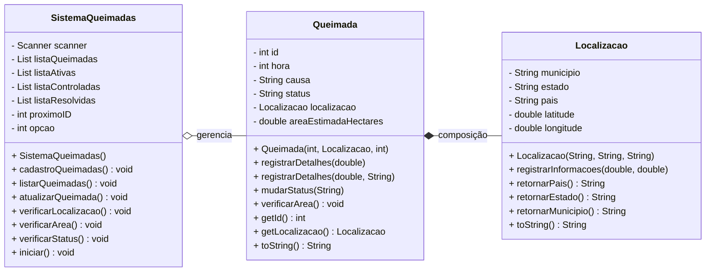

# Sistema_Queimadas
Sistema de registro de queimadas em Java para Global Solution FIAP 2025.

 
Clique para expandir o diagrama em Mermaid

```mermaid
classDiagram
direction LR

class Localizacao {
    - String municipio
    - String estado
    - String pais
    - double latitude
    - double longitude
    + Localizacao(String, String, String)
    + registrarInformacoes(double, double)
    + retornarPais() String
    + retornarEstado() String
    + retornarMunicipio() String
    + toString() String
}

class Queimada {
    - int id
    - int hora
    - String causa
    - String status
    - Localizacao localizacao
    - double areaEstimadaHectares
    + Queimada(int, Localizacao, int)
    + registrarDetalhes(double)
    + registrarDetalhes(double, String)
    + mudarStatus(String)
    + verificarArea() void
    + getId() int
    + getLocalizacao() Localizacao
    + toString() String
}

class SistemaQueimadas {
    - Scanner scanner
    - List<Queimada> listaQueimadas
    - List<Queimada> listaAtivas
    - List<Queimada> listaControladas
    - List<Queimada> listaResolvidas
    - int proximoID
    - int opcao
    + SistemaQueimadas()
    + cadastroQueimadas() void
    + listarQueimadas() void
    + atualizarQueimada() void
    + verificarLocalizacao() void
    + verificarArea() void
    + verificarStatus() void
    + iniciar() void
}

Queimada *-- Localizacao : composição
SistemaQueimadas o-- Queimada : gerencia

```
